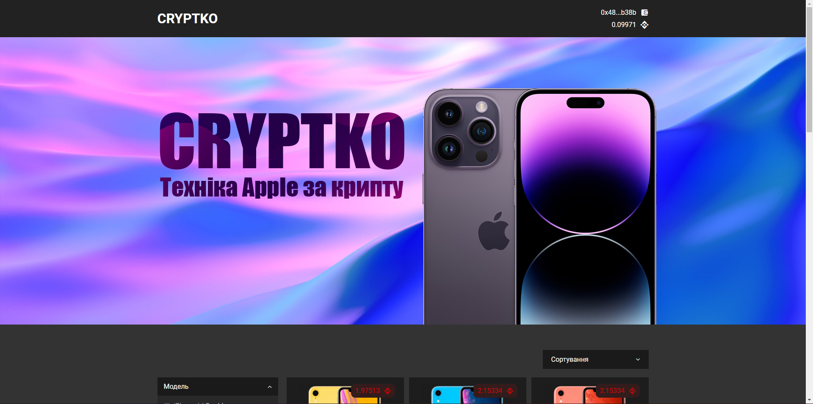
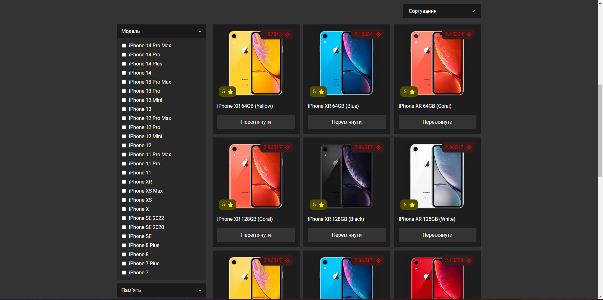
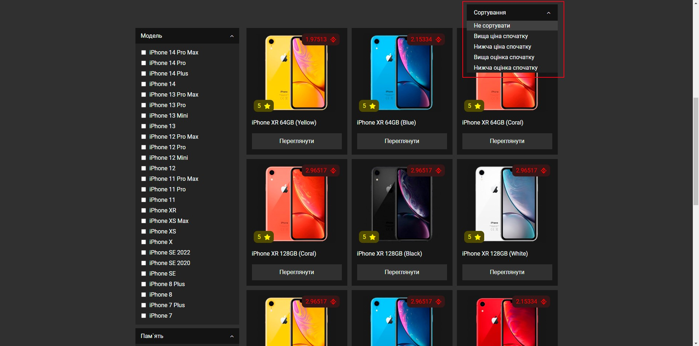
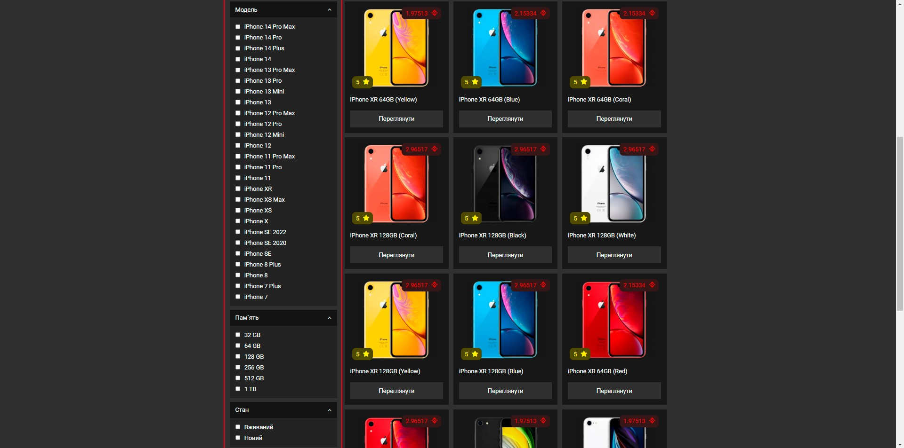
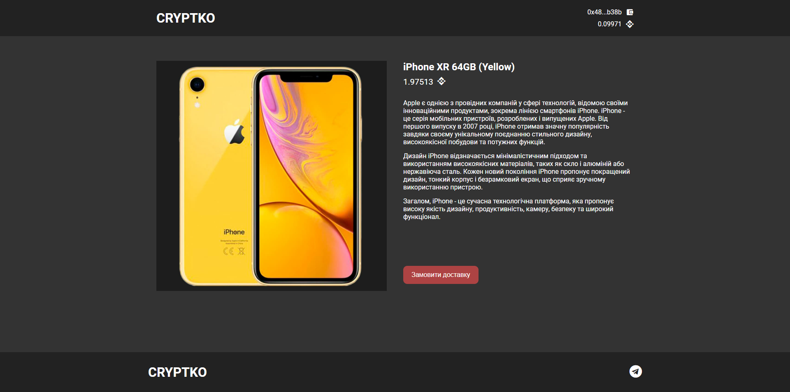
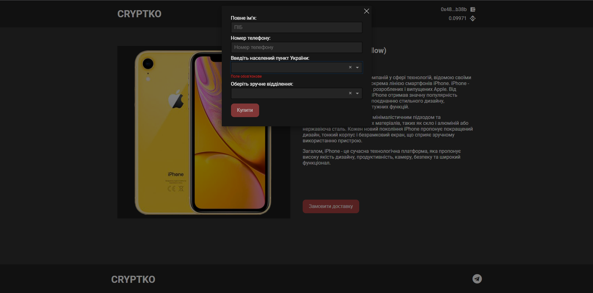
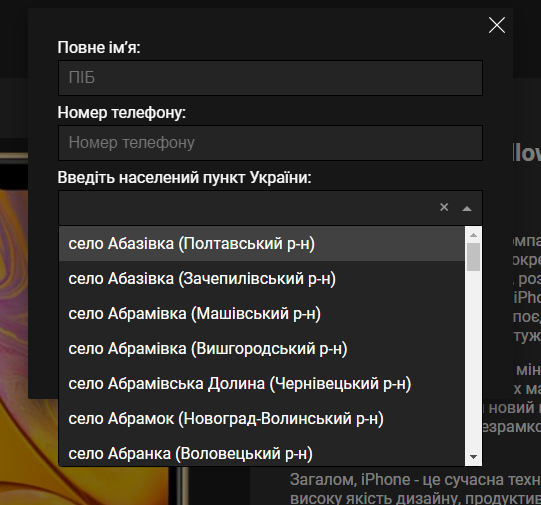
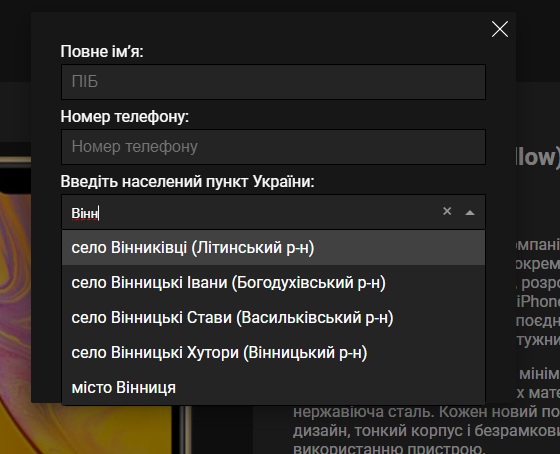
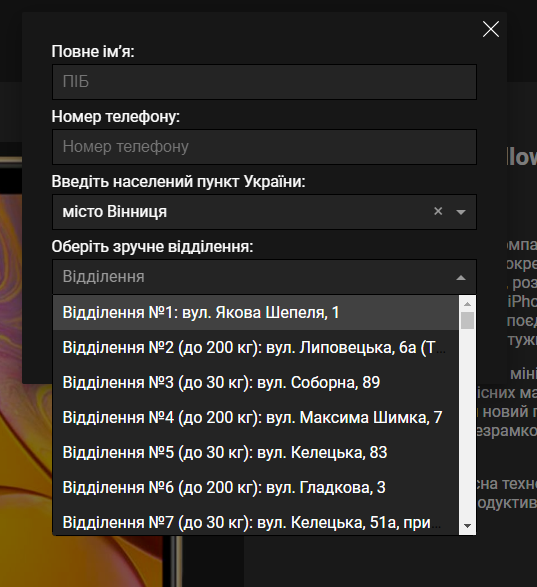

# Cryptko
## Головна сторінка

### Головна сторінка (товари)

### Головна сторінка (сортування)
Є 5 видів сортування:
- Не сортувати
- Вища ціна спочатку
- Нижча ціна спочатку
- Вища оцінка спочатку
- Нижча оцінка спочатку

### Головна сторінка (фільтрація)
Є 3 типи фільтрації
- Модель
- Пам'ять
- Стан

## Продукт

### Продукт (замовлення)
Для замовлення продукту потрібно заповнити форму з 4 полями:
- П.І.Б.
- Номер телефону
- Населений пункт
- Відділення

Дані про населені пункту та відділення підтягуються автоматично за допомогою NovaPoshta API 

